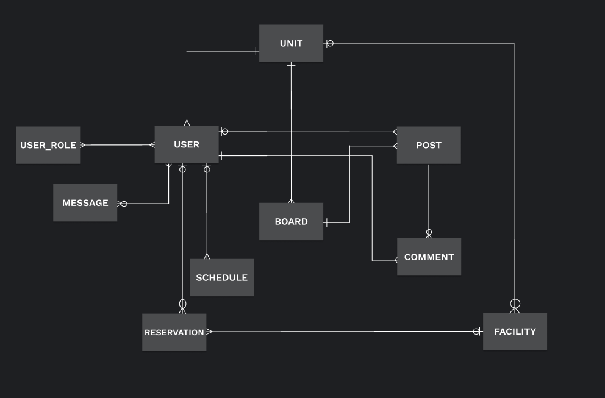

# DB Schema 설계

## DATABASE 요구 사항 분석
---
1. 개발자들이 쉽게 이용할 수 있어야 한다.
2. TypeORM과 호환되어야 한다.
3. 클라우드와 온프레미스 환경 둘 다에서 제공할 수 있어야 한다.
4. 엄격한 스키마 규격에 맞춰 데이터를 다뤄야 함

### 분석 결과
- 4번에 근거하여 RDBMS로 프로젝트를 진행한다.
- 2번과 3번을 만족하지 못하는 RDBMS를 사용하지 않는다.
- 1번에 따라 MySQL이 가장 적합할 것 같다.

## BUSINESS 요구 사항 분석
---
### 게시판 - 수근 님
- 부대 개설 시 기본적으로 제공되는 게시판들이 있다. (일정표, 공지사항이 해당됨)

- 관리자가 게시판을 새로 추가하거나 삭제할 수 있다. \

- **추가적인 게시판 관리 기능들(논의 필요)**

- 게시판의 구성 요소

    - 제목
    - 부제목 (게시판에 대한 간단한 소개글)
    - 작성 권한(ex 공지사항의 경우 관리자만??)
    - 볼 수 있는 권한
    - 작성자 공개 여부(익명, 실명)
    - 게시글 목록
        - 게시글
            - 제목
            - 본문
            - 사진 (multiple, ordered)
            - 작성시간
            - 좋아요 (multiple)
            - 댓글 (multiple, ordered)

### 유저 - 은찬 님
- 인증 기능

    - 회원 가입을 진행한다.

        - 이메일, 닉네임, 계정 비밀번호를 입력한다.
        - 이메일, 닉네임에 대한 중복 체크를 한다.
        - 이메일로 인증메일이 가고 이메일의 링크를 클릭하면 회원 가입이 완료 된다.
        - 로그인을 진행하는 페이지를 보여준다. 

    - 로그인을 진행한다.

        - 이메일, 비밀번호를 입력한다.
        - 로그인 성공 시 메인 페이지로 이동한다.
        - 로그인 실패 시 실패 메세지를 보여준다.

- 권한 기능

    - 접근 권한이 있는지 확인한다.(개인페이지, 게시글 작성 등 기능에 접근할 때)
    - *JWT 사용 - (논의 필요)*

- 부대 개설

    - *개설 방법 - (논의 필요)*
    - 개설 시 기본적인 게시판들이 생성됨

### 유저 권한 - 은찬 님
- user_role 로 관리, 해당 user_role에 대한 권한 설정을 어떻게 할지 고민이 필요함.

### 일정표 - 인규 님
- 달력에 근무 일정을 추가, 수정, 삭제한다.
    - 근무 일정
        - 제목
        - 설명
        - 날짜
        - *시작시간 & 종료시간(논의 필요)*
- 근무 전날 알림을 보낸다.

### DM - 은찬 님
- socket.io 사용
- 메시지 

## 개념적 설계

- 권한 기능 구현에 대해 더 고민이 필요하다.

## 물리적 설계

