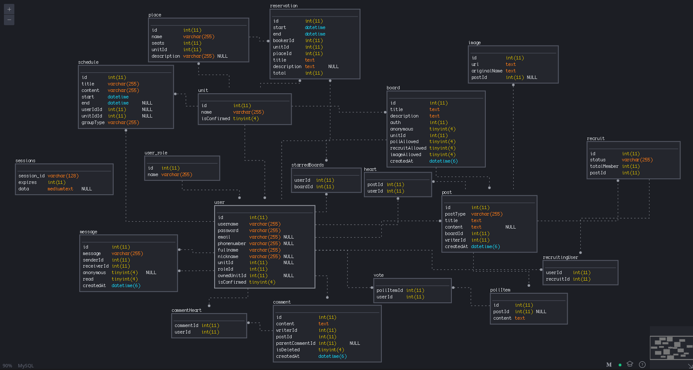

# DB Schema 설계

## ERD

|기능|관련 테이블|
|--------|---|
|부대 분류|unit|
|회원, 권한 기능|user, user_role|
|게시판, 게시판 즐겨찾기 기능|board, starredBoards|
|게시글, 게시글 좋아요 기능|post, heart|
|댓글, 대댓글, 댓글 좋아요 기능|comment, commentHeart|
|설문 조사 기능|pollItem, vote|
|모집 기능|recruit, recruitingUser|
|Direct Message 기능|message|
|시설물 예약 기능|place, reservation|
|스캐쥴 관리 기능|schedule|
